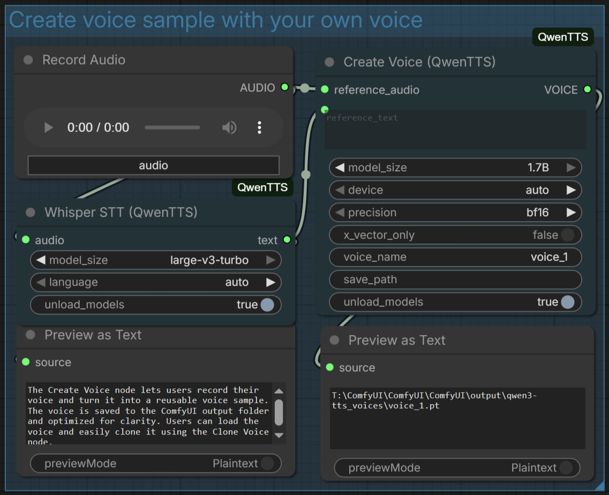

# ComfyUI-QwenTTS

**ComfyUI custom nodes for Qwen3‑TTS (12Hz)**: **CustomVoice**, **VoiceDesign**, and **VoiceClone** — with practical defaults for stability and speed on **CUDA / Apple Silicon (MPS) / CPU**.

> If this repo saves you time, please ⭐ it — it helps more ComfyUI users discover a working Qwen3‑TTS setup.


---

## What’s New (v1.1.0)

- **Voice Clone** supports reusable **`VOICE`** inputs from the Voices Library.
- New **Tools**: **Create Voice**, **Load Voice**, **Whisper STT**, and **Voice Instruct** presets (EN + CN).

- Advanced nodes expose attention selection: `auto / sage_attn / flash_attn / sdpa / eager`.
- README includes `extra_model_paths.yaml` guidance for custom model locations.
- **Audio Duration** node rewritten: cleaner logic, seconds-based outputs, optional frame calculation.

---

## Quickstart (3 minutes)

### 1) Install

**Option A — ComfyUI‑Manager (recommended)**
- Open ComfyUI‑Manager → search **ComfyUI‑QwenTTS** → Install.

**Option B — Git clone**
```bash
cd ComfyUI/custom_nodes
git clone https://github.com/1038lab/ComfyUI-QwenTTS.git
```

### 2) Install requirements (important)
Use ComfyUI’s embedded python if you’re on Portable:

**Windows Portable**
```bat
cd <ComfyUI_root>
python_embeded\python.exe -m pip install -r ComfyUI\custom_nodes\ComfyUI-QwenTTS\requirements.txt --no-cache-dir
```

**macOS/Linux (typical)**
```bash
python3 -m pip install -r ComfyUI/custom_nodes/ComfyUI-QwenTTS/requirements.txt --no-cache-dir
```

### 3) Import workflow
- Import: `example_workflows/QwenTTS.json`
- Run it once (first run is slower due to model download + warmup)

---

## Features

- **Custom Voice (preset speakers)**: easy, high-quality TTS with 9 timbres.
- **Voice Design**: create voices using a natural-language description.
- **Voice Clone**: clone from reference audio + transcript, or reuse a saved **`VOICE`**.
- **Multi‑Device**: auto select CUDA → MPS → CPU.
- **Local‑First models**: prefer `ComfyUI/models/TTS/Qwen3-TTS/`.
- **Tools bundle**: Create/Load Voice, Whisper STT, Voice Instruct presets, Text Token Count.
- **Advanced control nodes**: sampling, max_new_tokens, attention backend, unload.

---

## Models (Qwen3‑TTS 12Hz)

Supported Hugging Face model IDs:
- Qwen/Qwen3-TTS-12Hz-1.7B-CustomVoice
- Qwen/Qwen3-TTS-12Hz-0.6B-CustomVoice
- Qwen/Qwen3-TTS-12Hz-1.7B-VoiceDesign
- Qwen/Qwen3-TTS-12Hz-1.7B-Base
- Qwen/Qwen3-TTS-12Hz-0.6B-Base
- Qwen/Qwen3-TTS-Tokenizer-12Hz

This node auto-downloads missing models to:
```
ComfyUI/models/TTS/Qwen3-TTS/<MODEL_NAME>/
```

---

## Usage overview

### Basic nodes (fast defaults)
- Faster defaults (typically `do_sample=False`)
- Minimal inputs

### Advanced nodes (full control)
- Expose `max_new_tokens`, sampling knobs, **attention backend selection** (`auto/sage_attn/flash_attn/sdpa/eager`), unload_models, seed.

### Tips that fix 80% of “quality/length” issues
- **Set a sensible `max_new_tokens`** (too high can cause long humming / trailing noise).
- Prefer **do_sample=False** for stability.
- Use the speaker’s **native language** for best results.

---

## Optional speedups (CUDA)

### FlashAttention 2
```bash
pip install flash-attn --no-build-isolation
```

### SageAttention (experimental)
```bash
pip install sageattention
```

---

## Troubleshooting (common)

### 1) `'Qwen3TTSTalkerConfig' object has no attribute 'pad_token_id'`
This is usually an incompatible `transformers` build (often 5.x dev/nightly).

Fix (recommended):
```bash
pip install -U "transformers==4.57.3" "tokenizers<0.20" --no-cache-dir
```
Then restart ComfyUI.

### 2) Output always very long / humming
Lower `max_new_tokens` (try 512–1024 for short text), and set `do_sample=False`.
Tip: use **Text Token Count (QwenTTS)** to pick a safe `max_new_tokens` and reduce long trailing noise.

### 3) CUDA OOM
Split long scripts into chunks, lower `max_new_tokens`, and use `precision=bf16`.

---

## License
GPL‑3.0 (see LICENSE).

## Credits
- Qwen3‑TTS by Alibaba Qwen Team
- ComfyUI community
